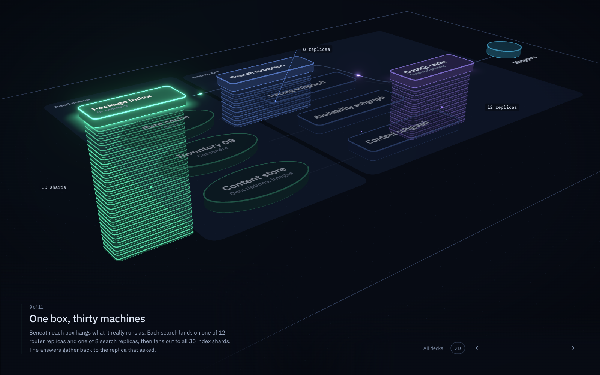

# Flow Explainer

Animated architecture explainers in three.js. A diagram is stepped through as scenes, like slides. Packets flow between services to show requests, fanouts and responses. Leaning the camera back shows the runtime layer: beneath each logical service hangs a tower of the instances it actually runs as (replicas, shards, partitions), and the same flows play out across those instances.



Content comes in decks (`src/decks/`), all made up for now:
- **OTA platform:** inventory ingestion on one side, search on the other, read stores in the middle.
- **Checkout:** a minimal example to copy when writing a new deck.
- **Synthetic estate:** about 300 services and 3,000 instances, generated to test scale.

## Running it

```sh
npm install
npm run dev
```

Open the dev server's URL to pick a deck, or go straight to one with `?deck=ota`. Use ← → or click to step through scenes, or add `#<scene number>` to the URL. Click a shape for more detail. Pinch or ctrl+scroll to zoom, scroll or drag to pan, option+drag to orbit, press `v` (or the 2D/3D switch) to flip between top-down and 3D, and press `0` to reset the view.

## Writing a diagram

Each deck is a folder in `src/decks/` whose `index.ts` default-exports a built model; new folders show up in the picker automatically. Decks are written with a TypeScript builder:

```ts
const d = diagram({ title: 'OTA platform', subtitle: '…' });

const router = d.node('router', { label: 'GraphQL router', role: 'edge', at: [15, 0],
  runtime: { kind: 'replicas', count: 12 } });
const subgraphs = d.set('subgraph', ['search', 'pricing'], {
  label: (k) => `${k} subgraph`, layout: column([10, 0], 2.3) });
d.connect(router, subgraphs);

d.flow('search', shoppers, (f) =>
  f.send(router).fanout(subgraphs).send('reads').respond().gather(router).respond());

d.scene({ title: 'A search', body: '…', show: ['api', 'reads'], reveal: 'onUse',
  runtime: [router], play: [{ flow: 'search', pause: 1.5 }] });

export default d.build();
```

The builder produces a plain-data model (`src/engine/model.ts`), which a text format can later compile to. See `CLAUDE.md` for the architecture, the design decisions behind it, and what's next.

## Authorship

The code in this repository was written by Claude, in [Claude Code](https://claude.com/claude-code). My part was direction: prompts, reviews, and taste: concepts, aesthetics, deciding what to build next, which of several attempts to keep, and what to throw away. 

## Licence

MIT. See [LICENSE](LICENSE).
